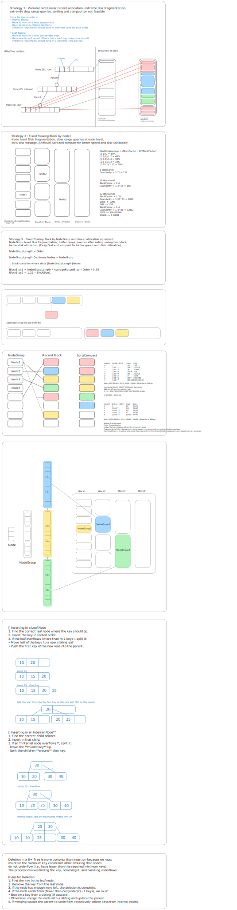

There are 3 types of data : Internal nodes, Leaf Nodes and Records

1. [Fixed size and number] Internal Nodes only store
2. [Fixed size and number] Leaf Nodes only store
3. [Arbitary size] Records

